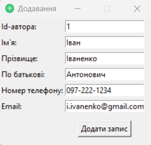

# SciJournal Manager

## Overview

This desktop application is designed to manage the submission, review, and publication process for scientific journal articles. It provides functionalities for authors to submit articles, for editorial boards to assign reviewers, and for reviewers to evaluate submissions. The system facilitates efficient communication between authors, reviewers, and editors, streamlining the publication workflow.

## Features

- **Submit articles** along with necessary metadata such as author information, abstracts in English and Ukrainian, keywords, and the link full-text file.

- **Review Assignment**: Editorial boards can assign two reviewers to each submitted article. Reviewers are chosen based on their expertise in the subject area.

- **Review Process**: Reviewers evaluate submissions based on criteria such as novelty, relevance, completeness of literature review, clarity of presentation, and text quality. They provide a numeric rating (1 to 10) for each criterion and submit a report detailing their impressions and feedback for the editorial board and authors.

- **Author Communication**: Authors receive feedback from reviewers and editors, including suggestions for revisions if necessary. They can communicate with the editorial board regarding the status of their submission.

- **CRUD Operations:** Basic CRUD operations (Create, Read, Update, Delete) are supported for all collections in the database. These operations allow users to add, edit, and delete records, with functionalities such as data validation and error handling.

- **Additional Functionalities:** Additional functionalities include viewing articles by author, viewing authors of an article, viewing keywords of an article, viewing articles by keyword, viewing thematic areas of a reviewer, and viewing reviewers of a thematic area.

## Technologies Used

- **Programming Language**: Python
- **GUI Framework**: Tkinter
- **Database**: ArangoDB
- **File Storage**: Arango Cloud storage

## ER-diagram
 
 ## Physical data model
 
 ## Show all authors
 
 ## Add new author
 
 ## Search author
 
 ## Sort authors
 
 ## Find articles of author
 